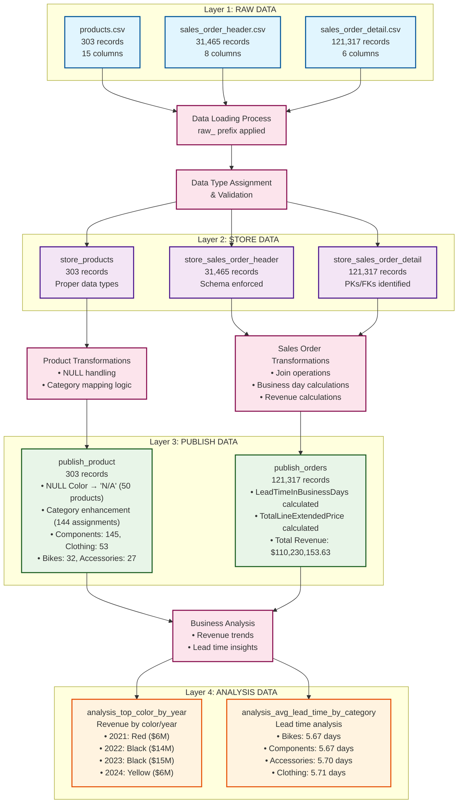

# Data Pipeline Architecture Diagram

## Mermaid Diagram

## Architecture Overview

### Data Flow Summary
1. **Raw Data Ingestion**: Three CSV files loaded with raw_ prefix
2. **Data Validation**: Proper data types assigned and schemas enforced
3. **Business Transformations**: Product categorization and sales calculations
4. **Analytical Insights**: Revenue and lead time analysis generated

### Key Metrics
- **Total Processing Time**: 43 seconds
- **Data Quality**: 100% successful processing
- **Storage Format**: Optimized Parquet files
- **Total Records Processed**: 152,685 raw → 121,620 transformed

### Technical Implementation
- **Primary**: PySpark for distributed processing
- **Alternative**: Pandas for single-node environments
- **Storage**: Columnar Parquet format for analytics
- **Validation**: Comprehensive error handling and logging
